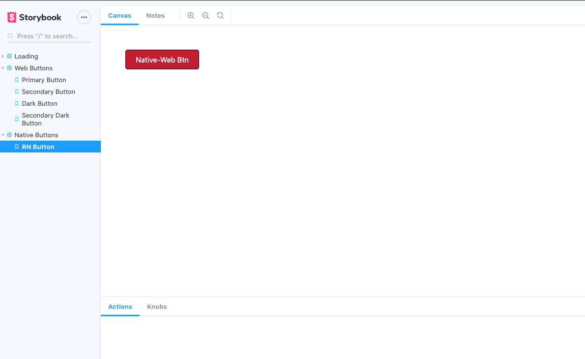

# Web + Mobile components

A small project to demonstrate how you can create a component framework with component for both web
and react-native.
This project was bootstrapped with [Create React App](https://github.com/facebook/create-react-app).

## Main Packages used

- storybook - For component prototyping
- styled-components - For easy styling
- react-native-web - for rendering native components on Web

### Installation and use

- Clone repo
- cd into the main repo directory and install deps with `yarn`
- Run storybook with `yarn storybook` - which automatically opens the browser and renders storybook components

### Note

- This project was developed quickly with some trial and errors that have not been documented and may not be a perfect
  setup but it's a minimal setup that works.

### Screenshot

Note: The red button is a react-native component but can rendered on Web using react-native-web

